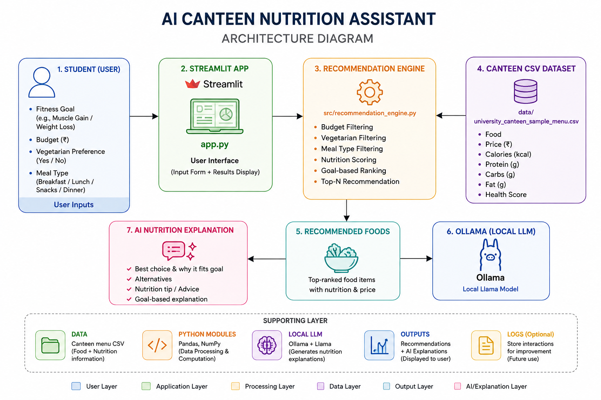
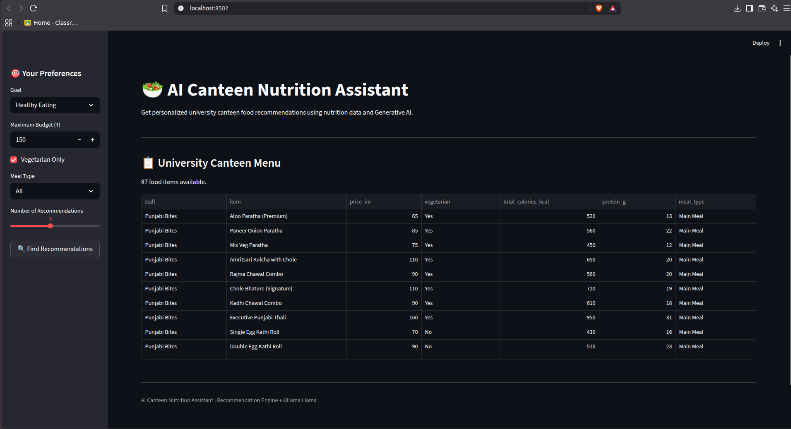
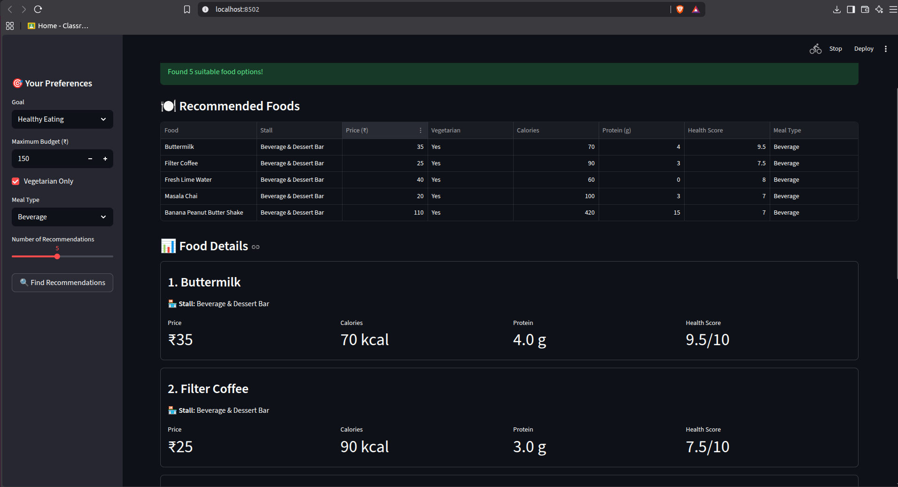
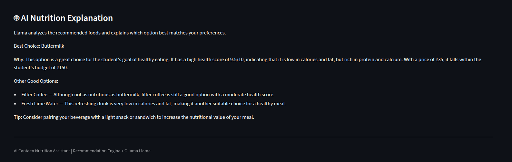

# 🍽️ AI Canteen Nutrition Assistant

An AI-powered university canteen nutrition assistant that helps students choose suitable food based on their nutritional goal, budget, dietary preference, and meal type.

The system combines a **rule-based nutrition recommendation engine** with a **locally running Llama model through Ollama**.

---

## 📌 Problem Statement

University students often have multiple food choices available in their canteen but may find it difficult to select meals that match their:

- **Nutritional goals**
- **Budget**
- **Dietary preferences**
- **Meal requirements**

This project provides an AI-assisted system that recommends suitable food options from a university canteen menu and explains the recommendations using Generative AI.

---

## 🎯 Objectives

The main objectives of the project are:

- Recommend suitable canteen food based on user preferences.
- Consider different nutritional goals.
- Respect the user's maximum budget.
- Support vegetarian food preferences.
- Filter recommendations according to meal type.
- Rank food items using nutritional and health-related information.
- Provide AI-generated explanations for the recommendations.
- Run the complete application locally.

---

## ⭐ Features

### Personalized Recommendations

Users can specify:

- **Health goal**
- **Maximum budget**
- **Vegetarian preference**
- **Meal type**
- **Number of recommendations**

### Nutrition-Based Recommendation Engine

The recommendation engine considers:

- **Calories**
- **Protein**
- **Carbohydrates**
- **Fat**
- **Health score**
- **Price**

### Goal-Based Recommendations

#### 💪 Muscle Gain

Higher importance is given to protein and suitable calorie content.

#### ⚖️ Weight Loss

Higher importance is given to health score, lower calorie content, and protein.

#### 🥗 Healthy Eating

Higher importance is given to health score, protein, reasonable calorie content, and affordability.

### 🤖 AI Nutrition Explanation

The recommended foods are passed to a locally running **Llama model through Ollama**.

Llama generates a natural-language explanation covering:

- Which recommendation best matches the selected goal.
- Why it may be suitable.
- How the other recommendations compare.
- A practical nutrition tip.

---

## 🛠️ Technologies Used

| Technology | Purpose |
|---|---|
| Python | Application development |
| Pandas | Dataset processing |
| Streamlit | Web application interface |
| Requests | Communication with Ollama |
| Ollama | Local LLM runtime |
| Llama | Generative AI explanation |
| Git | Version control |
| GitHub | Repository management |

---

# 🏗️ System Architecture

The system consists of five main components:

1. **University Canteen Dataset**
2. **Streamlit User Interface**
3. **Recommendation Engine**
4. **Ollama Local LLM Service**
5. **Llama Generative AI Model**

## 🔄 Workflow

```text
                    Student
                       │
                       ▼
          ┌─────────────────────────┐
          │      Streamlit UI       │
          │    User Preferences     │
          └────────────┬────────────┘
                       │
                       ▼
          ┌─────────────────────────┐
          │   Recommendation Engine │
          └────────────┬────────────┘
                       │
                       ▼
          ┌─────────────────────────┐
          │     Filter & Rank       │
          │      Food Items         │
          └────────────┬────────────┘
                       │
                       ▼
          ┌─────────────────────────┐
          │   Recommended Foods     │
          └────────────┬────────────┘
                       │
                       ▼
          ┌─────────────────────────┐
          │         Ollama          │
          │    Local LLM Runtime    │
          └────────────┬────────────┘
                       │
                       ▼
          ┌─────────────────────────┐
          │         Llama           │
          │    AI Explanation       │
          └────────────┬────────────┘
                       │
                       ▼
             Personalized Nutrition
                  Explanation
```

## 🖼️ Architecture Diagram



---

# 🧠 Recommendation Methodology

The recommendation engine follows a **filtering and ranking approach**.

## Step 1 — User Preferences

The system receives:

- **Nutritional goal**
- **Maximum budget**
- **Vegetarian preference**
- **Meal type**
- **Number of recommendations**

## Step 2 — Filtering

Food items that do not satisfy the user's basic requirements are removed based on:

- **Budget**
- **Vegetarian preference**
- **Meal type**

## Step 3 — Recommendation Scoring

The remaining food items are scored using nutritional and health-related factors such as:

- **Protein**
- **Health score**
- **Calories**
- **Price**

Different scoring weights are applied depending on the selected nutritional goal.

## Step 4 — Ranking

Food items are sorted according to their **recommendation score**.

The highest-ranked items are displayed to the user.

---

# 🤖 Generative AI Strategy

A key design decision in this project is the **separation of recommendation logic from Generative AI**.

## Recommendation Engine

The recommendation engine:

1. Reads the structured canteen dataset.
2. Applies user preferences.
3. Filters unsuitable food items.
4. Calculates recommendation scores.
5. Produces the top recommendations.

## Llama + Ollama

The selected recommendations and their nutritional information are provided to **Llama through Ollama**.

Llama then generates a natural-language explanation for the user.

## 🔄 AI Processing Flow

```text
Structured Canteen Data
          │
          ▼
Recommendation Engine
          │
          ▼
Food Recommendations
          │
          ▼
Ollama
          │
          ▼
Llama
          │
          ▼
AI Nutrition Explanation
```

> **Design Principle:** The Generative AI model is used for explanation and natural-language generation. It is not responsible for inventing food items, prices, or nutritional values.

---

# 📁 Project Structure

```text
ai-canteen-nutrition-assistant/
│
├── README.md
├── LICENSE
├── .gitignore
├── requirements.txt
├── app.py
│
├── src/
│   ├── recommendation_engine.py
│   └── ollama_service.py
│
├── data/
│   └── university_canteen_sample_menu.csv
│
├── docs/
│   ├── architecture.png
│   └── screenshots/
│       ├── 01_Website_interface.png
│       ├── 02_recommendations.png
│       ├── 03_recommendations.png
│       ├── 04_ai_explanation.png
│       ├── 05_user_pf1.png
│       ├── 06_Budget and User veg-non veg preference..png
│       └── 07_Meal_type.png
│
└── demo/
    └── demo.mp4
```

---

# ⚙️ Installation

## Prerequisites

Make sure the following are installed:

- **Python 3.x**
- **Git**
- **Ollama**
- **A compatible Llama model**

## 1. Clone the Repository

### SSH

```bash
git clone git@github.com:Miheer1064/ai-canteen-nutrition-assistant.git
cd ai-canteen-nutrition-assistant
```

### HTTPS

```bash
git clone https://github.com/Miheer1064/ai-canteen-nutrition-assistant.git
cd ai-canteen-nutrition-assistant
```

## 2. Install Python Dependencies

```bash
pip install -r requirements.txt
```

## 3. Install the Llama Model

For example:

```bash
ollama pull llama3.2
```

Check that the model is installed:

```bash
ollama list

```

## 4. Start Ollama

```bash
ollama serve
```

If Ollama is already running in the background, this step can be skipped.

## 5. Run the Streamlit Application

Open another terminal:

```bash
cd ai-canteen-nutrition-assistant
streamlit run app.py
```

The application will be available at:

```text
http://localhost:8501
```

---

# 🚀 Usage

1. Launch the Streamlit application.
2. Select a **nutritional goal**.
3. Enter the **maximum food budget**.
4. Select the **vegetarian preference**.
5. Select the desired **meal type**.
6. Select the **number of recommendations**.
7. Generate the recommendations.
8. Review the recommended food items and nutritional information.
9. View the **AI-generated nutrition explanation** from Llama.

---

# 📸 Screenshots

## Application Interface



## Food Recommendations



## AI Nutrition Explanation



Additional screenshots are available in the `docs/screenshots/` directory.

---

# 🎥 Demo Video

The complete demonstration video is available in:

`demo/demo.mp4`

The demonstration covers:

- **Application interface**
- **User preference selection**
- **Budget selection**
- **Dietary preference**
- **Meal type selection**
- **Food recommendations**
- **Nutritional information**
- **Ollama/Llama integration**
- **AI-generated nutrition explanation**

---

# 🔬 Local Execution

The project is designed to run **completely on a local machine**.

The application uses the local university canteen dataset for generating recommendations.

The Generative AI component uses a **locally running Llama model through Ollama**.

Therefore, the complete system can operate without depending on a cloud-based AI API.

---

# ⚠️ Limitations

- Recommendations depend on the accuracy and completeness of the canteen dataset.
- Nutritional values are based on the available dataset and may not represent exact serving values.
- The current dataset represents a sample university canteen menu.
- AI-generated explanations depend on the capabilities of the locally installed Llama model.
- The system provides general nutritional information and should not be considered professional medical or dietary advice.

---

# 🔮 Future Improvements

Potential future improvements include:

- **Real-time canteen menu updates**
- **More detailed nutritional information**
- **Personalized daily meal planning**
- **Student-specific nutrition profiles**
- **Allergy and food intolerance filtering**
- **Historical preference tracking**
- **Improved recommendation models**
- **Integration with university canteen ordering systems**

---

# 📜 License

This project is licensed under the **MIT License**.

See the `LICENSE` file for details.
